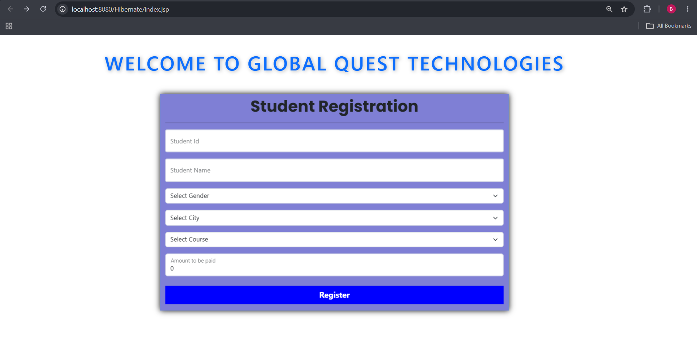
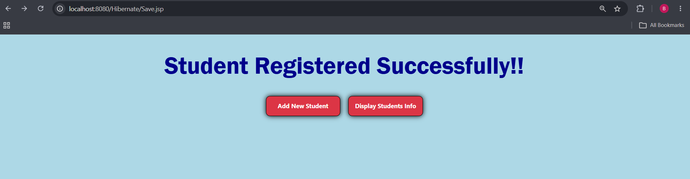
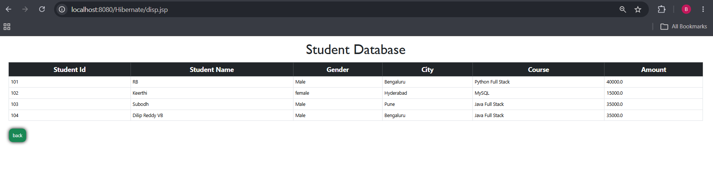

# 🎓 Student Registration System using Hibernate

A simple **Student Registration Management System** developed using **Java, Hibernate, JSP, Servlets, Maven, MySQL, and Bootstrap**. This project demonstrates CRUD operations with Hibernate ORM and follows the MVC architecture.

---

## 📌 Project Overview

This application allows users to:

- 📝 Register a new student
- 💾 Store student details in a MySQL database using Hibernate
- 📋 Display all registered students
- 💰 Automatically calculate course fees based on the selected course
- 🎨 Responsive UI using Bootstrap

---

## 🚀 Technologies Used

| Technology | Purpose |
|------------|---------|
| Java | Programming Language |
| JSP | View Layer |
| Servlets | Controller Layer |
| Hibernate ORM | Database Persistence |
| Maven | Dependency Management |
| MySQL | Database |
| Bootstrap 5 | Responsive UI |
| HTML5 | Structure |
| CSS3 | Styling |
| JavaScript | Dynamic Fee Calculation |

---

## 🏗️ Project Architecture

```
Browser
    │
    ▼
JSP (View)
    │
    ▼
Servlet (Controller)
    │
    ▼
Hibernate ORM
    │
    ▼
MySQL Database
```

---

# 📂 Project Structure

```
Hibernate
│
├── src
│   └── main
│       ├── java
│       │   └── com.rb.hibernate_major
│       │       ├── Student.java
│       │       ├── SaveRecord.java
│       │       └── DisplayRecord.java
│       │
│       ├── resources
│       │       hibernate.cfg.xml
│       │
│       └── webapp
│           ├── index.jsp
│           ├── Save.jsp
│           ├── disp.jsp
│           └── WEB-INF
│               └── web.xml
│
└── pom.xml
```

---

# ✨ Features

- Student Registration Form
- Automatic Course Fee Calculation
- Hibernate ORM Integration
- Data Stored in MySQL
- Display All Student Records
- Responsive Bootstrap Design
- MVC Architecture
- Maven Project

---

# 🗄️ Database

Database Name

```
Project
```

Table

```
Student
```

Columns

| Column | Type |
|---------|------|
| sid | int |
| name | varchar |
| gender | varchar |
| city | varchar |
| course | varchar |
| amount | float |

---

# ⚙️ Hibernate Configuration

- Hibernate Core 5.6.15
- MySQL 8
- MySQL Dialect
- Automatic Table Update
- Annotation Based Mapping

---

# 📷 Project Screenshots

## 🏠 Home Page



---

## 📝 Student Registration Form



---

## ✅ Registration Successful

> Upload image here



---

## 📋 Display Student Records


---

# ▶️ How to Run

### Clone Repository

```bash
git clone https://github.com/yourusername/Hibernate-Student-Registration.git
```

---

### Import Project

Import as

```
Existing Maven Project
```

---

### Configure Database

Create Database

```sql
CREATE DATABASE Project;
```

Update

```
hibernate.cfg.xml
```

with your MySQL username and password.

---

### Run on Apache Tomcat

Open

```
http://localhost:8080/Hibernate/
```

---

# 📚 Hibernate Workflow

```
JSP

↓

Servlet

↓

Student Object

↓

Hibernate Session

↓

Transaction

↓

MySQL Database

↓

Commit

↓

Display Page
```

---

# 🎯 Learning Outcomes

- Hibernate ORM
- JPA Annotations
- SessionFactory & Session
- Transactions
- HQL
- JSP
- Servlets
- Maven
- MySQL Integration
- MVC Architecture
- CRUD Operations

---

# 👨‍💻 Author

**RB**

AI & Data Science Engineer

GitHub: https://github.com/yourusername

LinkedIn: https://linkedin.com/in/yourprofile

---

## ⭐ If you like this project

Please consider giving this repository a ⭐ on GitHub.
