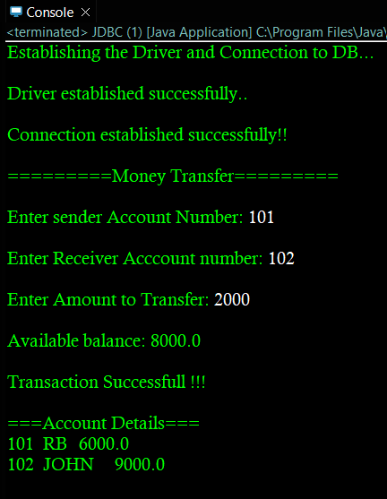

# 💳 JDBC Money Transfer System

A simple **Java JDBC Mini Project** that demonstrates **database transactions (Commit & Rollback)** using MySQL.

This project simulates money transfer between two bank accounts while maintaining data consistency using transaction management.

---

## 🚀 Features

- ✅ JDBC Connection with MySQL
- ✅ Creates table automatically (if not exists)
- ✅ Inserts sample account records
- ✅ Transfer money between accounts
- ✅ Balance validation
- ✅ Automatic Commit on successful transaction
- ✅ Rollback on failure
- ✅ Displays updated account details

---

## 🛠️ Technologies Used

- Java
- JDBC
- MySQL
- Eclipse IDE

---

## 📂 Database Structure

Database

```
Accounts
```

Table

```sql
Acc_Transactions
```

Columns

| Column | Type |
|---------|------|
| Acc_Number | INT (Primary Key) |
| Acc_Name | VARCHAR(20) |
| Acc_Balance | FLOAT |

---

## 📋 Sample Records

| Account No | Name | Balance |
|------------|------|---------|
| 101 | RB | 10000 |
| 102 | JOHN | 5000 |

---

# ⚙️ How It Works

1. Connects to MySQL database.
2. Creates table if it doesn't exist.
3. Inserts sample records.
4. Accepts:
   - Sender Account Number
   - Receiver Account Number
   - Amount
5. Checks sender balance.
6. Withdraws amount.
7. Deposits amount.
8. Commits transaction if successful.
9. Rolls back transaction if any error occurs.
10. Displays updated account details.

---

# 📸 Program Output

## Successful Transaction




---

## Failed Transaction (Rollback)

> Replace this image with your own screenshot.


---

## Updated Database Records

> Replace this image with your own screenshot.


---

# 📊 Transaction Flow

```
Start
   │
   ▼
Connect to Database
   │
   ▼
Create Table
   │
   ▼
Insert Sample Records
   │
   ▼
Enter Sender, Receiver & Amount
   │
   ▼
Check Balance
   │
   ├──────────────┐
   │              │
Enough Balance?   No
   │              │
 Yes             Rollback
   │              │
Withdraw          │
   │              │
Deposit           │
   │              │
Commit            │
   │              │
Display Records ◄─┘
   │
  End
```

---

# ▶️ Example Output

```
========= Money Transfer =========

Enter Sender Account Number:
101

Enter Receiver Account Number:
102

Enter Amount to Transfer:
3000

Available Balance:
10000.0

Transaction Successful!!

=== Account Details ===

101     RB      7000.0
102     JOHN    8000.0
```

---

## Example Rollback

```
========= Money Transfer =========

Enter Sender Account Number:
101

Enter Receiver Account Number:
102

Enter Amount to Transfer:
50000

Available Balance:
10000.0

Transaction Failed!!

Rollback

Reason:
Insufficient balance!

=== Account Details ===

101     RB      10000.0
102     JOHN    5000.0
```

---

# 📁 Project Structure

```
JDBC-Money-Transfer/
│
├── src/
│   └── Mini/
│       └── JDBC.java
│
├── images/
│   ├── success.png
│   ├── rollback.png
│   └── database.png
│
└── README.md
```

---

# 🎯 Learning Concepts

- JDBC
- MySQL Connection
- PreparedStatement
- ResultSet
- Transactions
- Commit
- Rollback
- Exception Handling
- Try-With-Resources

---

# 👨‍💻 Author

**Bharath R**

AI & Data Science Engineer

Java | JDBC | MySQL | Hibernate | Spring Boot
